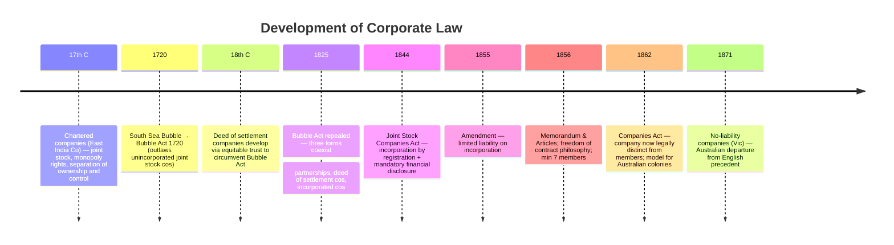
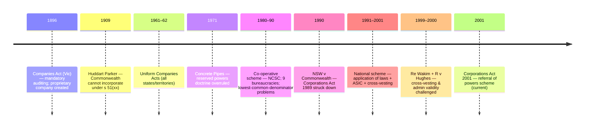

---
tags:
  - 'company law history'
  - 'incorporation by registration'
  - 'limited liability'
  - 'salomon principle'
  - 'public vs private companies'
  - 'uniform companies acts'
  - 'commonwealth constitutional power'
---
> [!important] Core Exam Themes
> Four **perennial tensions** in corporate law · Historical evolution of the corporation · Constitutional basis of the Corporations Act 2001 · The **referral of powers** scheme · ASIC's role · The **civil penalty regime** · Statutory interpretation of the Act

---

## 1. The Four Perennial Tensions ⭐

> [!TIP] Exam relevance
> These four tensions are a **conceptual framework** that recurs throughout the entire course. Examiners expect you to identify which tension a given issue engages.

| #     | Tension                          | Central Question                                                                                                                                         | Examples                                                                                          |
| ----- | -------------------------------- | -------------------------------------------------------------------------------------------------------------------------------------------------------- | ------------------------------------------------------------------------------------------------- |
| **1** | **Group vs Individual**          | To what extent should the law recognise *corporations* (rather than individuals) as bearers of rights, obligations & liabilities?                        | Should members limit their liability? Can a group hold property / sue independently of members?   |
| **2** | **Management vs Ownership**      | How should the law address the separation of ownership (members) from control (directors/officers)?                                                      | Minority shareholder protection; director accountability; agency costs                            |
| **3** | **Facilitation vs Intervention** | Should government regulation of corporations be minimal (facilitative) or active (interventionist)?                                                      | Laissez-faire philosophy of the 1856 Act vs mandatory disclosure rules post-Depression            |
| **4** | **Private vs Public**            | Are corporations essentially *private associations* for private profit, or do they owe their existence to the state and carry *public responsibilities*? | CSR debates; chartered companies' public purpose vs deed of settlement companies' private purpose |

> [!NOTE]
> These tensions **overlap** — the answer to one shapes the answer to another. There is no permanent "right" answer; positions have oscillated in response to economic crises, political shifts, and changing social expectations.

---

## 2. Historical Development — England (17th–19th Century)

### 2.1 Chartered Companies (17th–18th C)

- Earliest corporate form: companies incorporated by **Royal Charter** or **private Act of Parliament**.
- Granted for **commercial or public purposes** — typically foreign trading ventures.
- Key features:
  - **Joint stock principle** — members contributed to a common fund; profits distributed as dividends in proportion to shareholding.
  - **Free transferability** of shares — membership shaped by expectation of financial gain, not personal involvement.
  - **Separation of ownership and control** — business managed by a "court of directors," not by investors.
- Limited liability was **not necessarily express** but often assumed.
- Main incentive for seeking incorporation: **monopoly trading rights** in a defined geographical area (e.g. East India Company, Hudson Bay Company).
- Advantage for the state: trade encouraged and controlled; revenue raised from taxes and duties.
- Charters played a critical role in **Britain's colonial expansion**.

### 2.2 Adam Smith & Critiques of Chartered Companies

- **Adam Smith** (*The Wealth of Nations*, 1776):
  - Acknowledged monopolies might be *temporarily* necessary for new commerce.
  - Argued joint stock companies created **agency problems** — directors managing "other people's money" leads to "negligence and profusion."
  - Joint stock form only appropriate for routine enterprises (banking, insurance, canals).
- **John Stuart Mill**: accepted the risk of "hired servant" directors but argued joint stock companies had two advantages:
  1. Capacity for large-scale, continuing enterprise.
  2. Ability to hire directors with appropriate skills.
- **Karl Marx**: saw joint stock companies as evidence of capitalism's contradictions — ownership severed from control meant financial speculation would replace productive activity, leading to capitalism's decline.

### 2.3 Partnerships as the Alternative

| Type | Features |
|------|----------|
| **Societas** (common law partnership) | No separate legal status; partners shared profits, losses, and liabilities; all partners directly involved → limited size |
| **Commenda** | Active partners (full liability) + dormant partners (liable only to extent of contribution); not widely used in England |

**Key terminology distinction (18th century):**
- **Company** = large commercial association with joint stock, managed by committee (**economic** term, not legal).
- **Partnership** = small association with direct involvement in management.
- **Corporation** = legal status granted by charter or Act.
- At common law, both companies and partnerships **had no separate legal status** unless incorporated.

### 2.4 The South Sea Bubble & Bubble Act 1720

- **South Sea Company** (formed 1711): offered to take over almost all national debt from the British Government.
  - Scheme: Government creditors could swap annuities for company shares.
  - Share price surged → then **collapsed** → burst the investment bubble.
- Speculation fever spawned many fraudulent "bubble companies."
- **Bubble Act 1720**: first instance of modern company legislation.
  - Made it **illegal** to form a joint stock company with transferable shares without Royal Charter or Act of Parliament.
  - Purpose: confine the boom market benefits to the South Sea Company.
  - Symbolic impact: expressed disapproval of rampant financial speculation.
  - Few immediate prosecutions, but shaped the scope of speculative activity.

### 2.5 Deed of Settlement Companies

- Created by lawyers to circumvent the Bubble Act & overcome partnership limitations.
- Structure: investors subscribed funds → vested in **trustees** under an **equitable trust** → managed according to a **deed of settlement**.
- The deed contained mutual promises between investors (members) and trustees.
- Joint stock divided into units with nominal restrictions on transfer (to evade the Bubble Act).
- **Only recognised in equity** — common law classified them as partnerships.
- **Maitland**: "In truth and in deed we made corporations without troubling King or Parliament."
- Conflict between law and equity: "The two branches of the law were thus in conflict over the new business unit."
- **Significance**: shift from *public* to *private* purposes — deed of settlement companies were vehicles for promoting private interests (unlike chartered companies which were clothed in public responsibility).

### 2.6 Joint Stock Companies Act 1844

> [!IMPORTANT]
> This Act is a **landmark** — the first step toward a system of company law based on *legislative regulation* rather than common law doctrine.

**Two foundational elements** (still underpin modern corporate regulation):

| Element | Detail |
|---------|--------|
| **Public registration** | Deed of settlement companies with >25 members or freely transferable shares must register with the Board of Trade. Registration automatically conferred legal privileges (sue/be sued, hold property). **Shift from individual charters to general incorporation by registration.** |
| **Public financial accountability** | Annual balance sheets, audited, filed with Registrar. Gladstone: "*Publicity is all that is necessary. Show up roguery and it is harmless.*" |

**Key points:**
- The Act used "they" and "them" when referring to the company → company still seen as a **collection of individuals**, not a separate entity.
- **No limited liability** — each shareholder liable for company debts. Purpose was to *protect the public*, not induce incorporation.
- **1855 amendment**: limited liability became an entitlement on incorporation. Shareholder liability limited to unpaid share amount. Companies required to include "**Limited**" in their name.

### 2.7 Joint Stock Companies Act 1856

Key innovations:

| Feature | Detail |
|---------|--------|
| **Memorandum of Association** | Registration document containing basic company information |
| **Articles of Association** | Internal regulations; model set supplied by the Act |
| **Reduced minimum members** | From 25 to **7** |
| **Partnerships >20 persons** | Must incorporate under the Act |
| **Limited liability** | Available on terms specified in Memorandum and Articles |
| **No mandatory auditing** | Removed previous emphasis on financial publicity (accounting provisions relegated to model Articles only) |

- Philosophy: **freedom of contract** and **right of unlimited association** — Robert Lowe: individuals, not governments, are best placed to protect their own interests.
- S 3 still treated the company as co-extensive with its members: "seven or more persons … form themselves into an incorporated company."

### 2.8 Companies Act 1862

Three exam-worthy points:

1. **Linguistic shift**: s 6 — persons could "form *an* incorporated company" → company now **distinct from its members**.
2. **Financial disclosure** still relegated to model Articles — not yet a major public concern.
3. **Increasing length and complexity** — 212 sections (vs 116 in 1856). Corporate legislation becoming more detailed and technical.

**Salomon v Salomon & Co Ltd [1897]:**
- Confirmed the concept of the **one-person limited liability company**.
- Contrary to the original legislative intent — the 1862 Act was designed for joint stock enterprises (proto-public companies), not sole traders.
- By early 1900s, the heaviest users were sole proprietors and small businesses, driven by the **Long Depression** (1873–96) and the attraction of limited liability.
- Term "**private company**" emerged to describe what were essentially incorporated partnerships.

---

## 3. Historical Development — Australia

### 3.1 Small Beginnings (1788–1850s)

- Early activity dominated by English-based deed of settlement companies, chartered companies, and those incorporated by special Act.
- First local company: **Bank of New South Wales** (1817) — started as a joint stock company under Governor Macquarie's charter; adopted a deed of settlement in 1828 (becoming a partnership with unlimited liability); reincorporated via legislation in 1850.

### 3.2 Boom and Depression (1850s–1890s)

- Gold rushes → expansion → 1880s land boom → 1890s depression.
- Victoria particularly affected — speculative land developments funded by British capital.
- Company registrations: NSW 13 (1875) → 227 (1888); Victoria 27 (1875) → 342 (1888).
- **"Dummying" problem**: investors used false names to avoid paying called amounts on shares.
- **Victoria's response**: *Companies (Mining) Act 1871* — created **no-liability companies** (shareholders who didn't respond to a call forfeited shares without further liability). **First departure from English precedent.**
- Legislative framework inadequate: few mechanisms for investors to discover directors' interests; no mandatory auditing.

### 3.3 Early Moves Towards Uniformity (1890s–1930s)

- 1890s depression: 13 banks closed in 6 weeks; 54 banks closed between 1891–1893.
- Widespread fraud exposed: falsified balance sheets, dividends from non-existent profits, misleading forecasts.
- **Companies Act 1896 (Vic)** — major reform:
  - Compulsory books of account, annual balance sheets, audits.
  - Statutory duties for directors and auditors.
  - Created the **proprietary company** — exempt from new accounting/auditing rules (max 25 members, "proprietary limited" suffix). English equivalent ("private company") not introduced until 1908.
- **Constitutional obstacle**: s 51(xx) of the Constitution gives Commonwealth power over "foreign corporations, and trading or financial corporations *formed within* the limits of the Commonwealth."
  - **Huddart, Parker & Co Ltd v Moorehead (1909)**: High Court held s 51(xx) confined to corporations **already in existence** — Commonwealth cannot legislate for *incorporation*. This barred Commonwealth entry into corporate regulation for nearly a century.

### 3.4 The First Uniform Legislation (1950s–1980)

- Post-WWII prosperity highlighted differences in state legislation.
- **Uniform Companies Acts (1961–62)**: adopted by all states/territories, based on the Companies Act 1958 (Vic). Sources included Model Business Corporation Act (US), Cohen Committee report (UK), and Gower's Ghana report.
- Uniformity was **tenuous**: no administrative uniformity; states began amending independently.
- 1960s: spectacular corporate collapses (Reid Murray, Cox Brothers, Korman). Problems: inactive/incompetent directors, self-interested managers, inadequate auditors.
- **1968–72 mining boom**: Poseidon NL shares rose from <$1 to $280 in 5 months. Prompted securities legislation.
- **Rae Committee (1970–74)**: recommended national securities legislation and a national regulatory body (like the US SEC). Found only a national body could "eliminate the variation in administrative practice."
- **Strickland v Rocla Concrete Pipes Ltd (1971)**: High Court overruled Huddart Parker's reserved powers doctrine, reopening the door for federal legislation.
- **Corporations and Securities Industry Bill 1974 (Cth)**: drafted but lapsed when Whitlam Government dismissed (Nov 1975).
- **ICAC** (1974): NSW, Vic, Qld + later WA established the Interstate Corporate Affairs Commission to promote uniformity.

### 3.5 The Co-operative Scheme (1980–90)

- 1978 agreement: Commonwealth + 6 states + NT.
- **"Application of laws" mechanism**: Commonwealth passed legislation applying only to the ACT; each state/territory then passed legislation applying the ACT legislation as state/territory law.
- Key legislation: Companies Act 1981, Securities Industry Act 1980, Companies (Acquisition of Shares) Act 1980.
- **Three tiers of administration**:

| Level | Body | Role |
|-------|------|------|
| **1. Ministerial Council** | Attorneys-General from each government | Review legislation and approve amendments |
| **2. NCSC** | National Companies & Securities Commission | General administration and policy |
| **3. State/Territory** | Corporate Affairs Commissions/Offices | Day-to-day operation |

- **Problems** (1987 Senate Committee report):
  1. **No ministerial accountability** to federal parliament — NCSC answerable only to Ministerial Council.
  2. **Administrative duplication** — 9 different bureaucracies with inconsistent practices.
  3. **Lowest common denominator** decision-making — any state could threaten withdrawal to veto reforms.

### 3.6 The Corporations Act 1989 & the Incorporation Case

- Commonwealth passed the Corporations Act 1989 (Cth) — comprehensive national legislation.
- States challenged in the High Court.
- **New South Wales v Commonwealth (1990) ("the Incorporation Case")**: 6:1 majority held Commonwealth has **no power under s 51(xx) to incorporate companies**.
  - Majority: "formed within the limits of the Commonwealth" refers to corporations *already created* — not a power to bring them into existence.
  - **Deane J (dissent)**: criticised the majority's "unacceptably narrow and technical construction."

### 3.7 The National Scheme (1991–2001)

- **Alice Springs agreement** (June 1990): new national scheme based on the (amended) Corporations Act 1989.
- Three components: (1) uniform legislation via application of laws, (2) uniform administration by **ASIC**, (3) single court system via cross-vesting of jurisdiction.
- **Constitutional challenges**:
  - **Re Wakim (1999)**: cross-vesting arrangements held invalid — states cannot confer jurisdiction on the Federal Court under ss 75–77 of the Constitution.
  - **R v Hughes (2000)**: doubts about Commonwealth officers exercising powers conferred by state law. Kirby J: "So complex is the interlocking legislation, with fiction piled upon fiction, that it must be doubted whether any of those presenting and enacting it were truly aware of precisely what they were doing."

---

## 4. The Current Scheme — Corporations Act 2001

### 4.1 Constitutional Basis (s 3)

The Act relies on **three sources** of Commonwealth power:

| #   | Source                                                | Scope                                                                                       |
| --- | ----------------------------------------------------- | ------------------------------------------------------------------------------------------- |
| 1   | **s 51 legislative powers**                           | General Commonwealth heads of power — but does **not** extend to registration/incorporation |
| 2   | **s 122 (territories power)**                         | Ensures coverage in ACT and NT                                                              |
| 3   | **s 51(xxxvii) — referral of powers from the states** | Supplies the authority the Commonwealth otherwise lacks (per *NSW v Commonwealth*)          |

### 4.2 Referral of Powers (ss 4(4)–(5))

Each referring state makes **two referrals**:

| Referral                         | Purpose                                                                                                            |
| -------------------------------- | ------------------------------------------------------------------------------------------------------------------ |
| **Initial reference** (s 4(4))   | Sufficient power to enact the original Corporations Act and ASIC Act                                               |
| **Amendment reference** (s 4(5)) | Power to make *express* amendments in relation to formation, corporate regulation, and financial products/services |

- "Express amendment" = direct amendment to the Act; cannot indirectly legislate on other matters (s 4(9)).
- Referral terminates after **5 years** unless extended. Latest extension: June 2021 (expires July 2031).
- If a state's initial reference terminates → that state ceases to be a "referring State" and falls outside the Corporations Act's jurisdiction.
- System depends on **continued political co-operation** — a constitutional amendment via referendum would provide a more certain foundation.

### 4.3 Jurisdiction (ss 9, 5(2))

- "This jurisdiction" = each referring state + ACT + NT.
- If all states refer power → "this jurisdiction" = **all of Australia**.
- A registered company is incorporated in the jurisdiction covered by the Act (s 119A(1)) and taken to be registered in the state/territory specified in its application (s 119A(2)).

### 4.4 Delegated Legislation & Other Sources

| Source | Role |
|--------|------|
| **Corporations Regulations 2001** (pt 9.12) | Give effect to primary provisions; define terms, prescribe procedures, amounts, fines, penalties. Increasingly used for substantive purposes (modifying Act provisions, granting exemptions) |
| **ASIC legislative instruments** (formerly "class orders") | Omit, modify, or vary Act provisions generally or for a class of persons — issued for gaps, unintended consequences, or anticipated amendments |
| **ASX operating rules** | Govern admission to official list and trading of securities |
| **Accounting/auditing standards** | Made by the AASB and AUASB |

> [!CAUTION]
> A particular provision of the Act may effectively comprise the formal text **plus** modifications from applicable ASIC legislative instruments. Always check for instruments.

---

## 5. ASIC — The Australian Securities & Investments Commission

### 5.1 Statutory Objectives (ASIC Act s 1(2))

ASIC must strive to:
- **(a)** Maintain, facilitate and improve the financial system — commercial certainty, reducing costs, economic efficiency.
- **(b)** Promote confident and informed participation of investors and consumers.
- **(d)** Administer laws effectively with minimum procedural requirements.
- **(e)** Process information efficiently and quickly.
- **(f)** Make information available for public access promptly.
- **(g)** Enforce Commonwealth laws.

> [!NOTE]
> There is a **built-in tension** between (a) (facilitation/efficiency) and (b)/(g) (investor protection/enforcement). This reflects the broader facilitation vs intervention debate.

### 5.2 Key Functions

- Regulation and surveillance of public fundraising and securities markets.
- Investigations and enforcement of the Act (including granting exemptions/relief).
- Collection and processing of company information (registration, lodgement).
- Advising the Treasurer on the Act's operation and law reform proposals (ASIC Act s 11).

### 5.3 Accountability

- Formally responsible to the **Commonwealth Treasurer** and Parliament.
- Minister can **direct** ASIC on policy priorities (s 12); ASIC must comply.
- Biennial review by the **Financial Regulator Assessment Authority (FRAA)** — independent body established following the 2019 Banking Royal Commission.

### 5.4 ASIC and the DPP

- Criminal prosecution: shared responsibility between ASIC and the **Commonwealth DPP**.
- ASIC gathers evidence → refers to DPP for charging decision.
- ASIC can prosecute **minor regulatory offences** with a guilty plea without DPP referral.

---

## 6. The Civil Penalty Regime (Part 9.4B) ⭐

> [!IMPORTANT]
> The civil penalty regime is a central **enforcement mechanism** of the Act. Understand the pyramid model and the available orders.

### 6.1 The Enforcement Pyramid (Braithwaite & Fisse)

The regime is based on a "**pyramidal enforcement**" model:

```
        ┌──────────────┐
        │  Criminal     │  ← Last resort (fines, prison)
        │  sanctions    │
        ├──────────────┤
        │  Civil        │  ← Pecuniary penalties, disqualification
        │  penalties    │
        ├──────────────┤
        │  Compensation │
        │  orders       │
        ├──────────────┤
        │  Infringement │  ← E.g. continuous disclosure
        │  notices      │
        ├──────────────┤
        │  Negotiated   │  ← Enforceable undertakings
        │  resolution   │
        ├──────────────┤
        │  Regulatory   │  ← Base: advice, warnings, guidance
        │  guidance     │
        └──────────────┘
```

**Rationale** for graduated enforcement:
1. A system relying *predominantly* on criminal penalties discourages legitimate risk-taking and attaches criminal stigma to minor procedural failures.
2. Actors are most likely to comply when enforcement can be **escalated** in response to non-compliance.

### 6.2 Designated Civil Penalty Provisions

- Key civil penalty provisions are listed in **s 1317E** — include **directors' duty sections (ss 180–183)**.
- If a contravention occurs, **two possible consequences**:

#### Consequence 1: Declaration of Contravention + Orders

ASIC applies to court for a **declaration of contravention** (s 1317J(1)). If granted, ASIC can then seek:

| Order | Detail | Authority |
|-------|--------|-----------|
| **Pecuniary penalty** | *Individual:* greater of **5,000 penalty units** or 3× benefit derived/detriment avoided. *Body corporate:* greater of **50,000 penalty units**, 3× benefit/detriment, or **10% annual turnover** (capped at 2.5M penalty units) | s 1317G |
| **Relinquishment order** | Pay an amount equal to the benefit derived/detriment avoided (can be made *in addition* to pecuniary penalty) | s 1317GAB |
| **Disqualification order** | Disqualified from managing corporations for a period determined by the court | s 206C |

#### Consequence 2: Compensation Order

- May be sought by **ASIC or the company** (ss 1317J(1)–(2), 1317H, 1317HA).
- Compensation for **damage resulting from the contravention**.
- Does **not** require a prior declaration of contravention.

### 6.3 Interaction with Criminal Proceedings

- Some provisions **expressly** create criminal offences (e.g. **s 184** — directors' duties; **s 1043A** — insider trading).
- Even where a civil penalty provision does not itself create an offence, **s 1311(1)** makes it an offence to do something forbidden by the Act (*ASIC v Whitebox Trading*).
- If **convicted** of an offence → cannot also receive a declaration of contravention or pecuniary penalty for the same conduct (s 1317M).
- **Criminal proceedings can still commence** even if civil orders have been made, if there is an applicable offence provision and the conduct is substantially the same (s 1317P).

### 6.4 Royal Commission Criticism

> The Banking Royal Commission (2019) criticised ASIC's enforcement:
> *"Too often serious breaches of law by large entities have yielded nothing more than a few infringement notices, an enforceable undertaking … not to offend again … or some agreed form of media release."*

---

## 7. Interpretation of the Corporations Act

### 7.1 The Purposive Approach

- **Acts Interpretation Act 1901 (Cth)**, ss 15AA–AD:
  - **s 15AA**: Prefer the interpretation that achieves the Act's **purpose or object**.
  - **s 15AB**: Extrinsic material (explanatory memoranda, second reading speeches, committee reports) can be used to confirm meaning or resolve ambiguities.

### 7.2 ASIC Regulatory Guides

- ASIC publishes **regulatory guides** — formal statements on how ASIC interprets and applies the Act.
- **Not binding** on courts: *Bond Corporation v Grace Brothers* — Sheppard J: regulatory guides "are proper to be considered" but "cannot bind a judge." "[N]othing done by an officer of the executive government can control the construction of an Act of Parliament unless the Parliament itself has said so."
- Gageler CJ: s 15AB does "not result in extrinsic material being substituted for the words of the statute."

### 7.3 Complexity of the Legislation

- The Act contains a **mixture of drafting styles**: some broad principles (allowing interpretive discretion), others lengthy and technical (minimising discretion).
- Sir Anthony Mason: excessive legislative detail "can obscure the identification of policy goals and guidelines."
- **Small Business Guide** (pt 1.5): inserted to make the Act more accessible — summarises main rules for proprietary companies limited by shares.
- ALRC has recommended redesign of Ch 7 (financial services) to address the "legislative maze."

### 7.4 Impact of General Law (Common Law & Equity)

Three modes of interaction between the Act and the general law:

| Mode                                            | Description                                                                                        | Example                                                                                                |
| ----------------------------------------------- | -------------------------------------------------------------------------------------------------- | ------------------------------------------------------------------------------------------------------ |
| **1. Act replaces general law**                 | Statute expressly abolishes pre-existing common law/equity rules                                   | **s 236(3)** — abolishes the right to bring a shareholder derivative action at general law (pt 2F.1A)  |
| **2. Act draws on general law**                 | Statute incorporates/modifies general law rules; question is how far Parliament intended to depart | **ss 128–129** — assumptions in corporate contracting, understood by reference to established case law |
| **3. Act and general law operate side by side** | Statutory provisions enforceable by ASIC; general law doctrines provide separate causes of action  | **pt 2D.1** — directors' duties: statutory duties + general law fiduciary/care obligations             |

---

## 8. Two Parameters of Corporate Law

> [!TIP] Exam framing
> When answering questions, remember that Australian corporate law is only concerned with **two sets of relationships**:

1. **Insiders**: rights, duties and liabilities of **members** and **directors**.
2. **Outsiders**: relations between the company and **creditors**, contracting parties, and **regulators**.

Corporate law does **not** directly address the role of corporations as: employers, taxpayers, or environmental actors. *Whether this demarcation is defensible is a recurring exam theme.*

---

## 9. The Convergence Debate

- **Convergence thesis**: corporate law globally is converging on the **Anglo-US shareholder-centred model** (prioritising shareholder interests over stakeholders).
- **Critique** (Christopher Bruner): "generalizations regarding the so-called Anglo-American … corporate governance model obscure more than they illuminate." Australia, UK, US, and Canada "diverge markedly in terms of the degree of governance power granted to shareholders."
- **Problems with convergence**: (1) disregards local legal, regulatory, political, economic and social conditions; (2) assumes corporate law "evolves" linearly — Australian history shows **uneven, crisis-driven** development.

---

## Quick Reference — Key Legislation & Cases (Chapter 1)

### Key Legislation

| Legislation                           | Significance                                                                                      |
| ------------------------------------- | ------------------------------------------------------------------------------------------------- |
| **Bubble Act 1720**                   | First company legislation; outlawed unincorporated joint stock companies with transferable shares |
| **Joint Stock Companies Act 1844**    | Introduced incorporation by registration + mandatory financial disclosure                         |
| **1855 Amendment**                    | Limited liability became an entitlement on incorporation                                          |
| **Joint Stock Companies Act 1856**    | Memorandum & Articles of Association; minimum 7 members; freedom of contract philosophy           |
| **Companies Act 1862**                | Company recognised as distinct from members; model for first Australian statutes                  |
| **Companies (Mining) Act 1871 (Vic)** | No-liability companies — first Australian departure from English precedent                        |
| **Companies Act 1896 (Vic)**          | Mandatory accounting/auditing; created the proprietary company category                           |
| **Corporations Act 2001 (Cth)**       | Current national legislation — relies on referral of powers from states                           |

### Key Cases

| Case                                                 | Principle                                                                                                     |
| ---------------------------------------------------- | ------------------------------------------------------------------------------------------------------------- |
| **Huddart, Parker & Co Ltd v Moorehead** (1909)      | Commonwealth under s 51(xx) confined to *existing* corporations — cannot legislate for incorporation          |
| **Strickland v Rocla Concrete Pipes Ltd** (1971)     | Overruled Huddart Parker's reserved powers doctrine; reopened door for federal legislation                    |
| **NSW v Commonwealth** (1990) ("Incorporation Case") | Commonwealth has **no power** under s 51(xx) to incorporate companies. 6:1 majority (Deane J dissent)         |
| **Re Wakim** (1999)                                  | Cross-vesting of state jurisdiction to Federal Court under ss 75–77 Constitution held **invalid**             |
| **R v Hughes** (2000)                                | Doubts about Commonwealth officers exercising powers conferred by state law; prompted current referral scheme |
| **Bond Corp v Grace Brothers**                       | ASIC regulatory guides are "proper to be considered" but **cannot bind** a judge                              |

---

## Historical Timeline Summary



