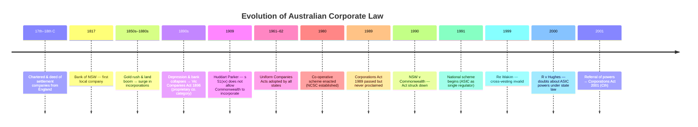

> [!important] Topics
> What is a company · Registration · Pre-registration activities · Business structures compared · Classifying companies · Nature & history of company law

---

## Key Statutes
| Section       | Subject                                                                                                     |
| ------------- | ----------------------------------------------------------------------------------------------------------- |
| **s 9 CA**    | Definitions — company limited by shares; company limited by guarantee                                       |
| **s 45A CA**  | Tests for small vs large proprietary companies (read with **cl 1.0.02B Regs**)                              |
| **s 112 CA**  | Public companies — all companies other than proprietary companies                                           |
| **s 113 CA**  | Proprietary company limits — min 1 / max 50 non-employee shareholders; cannot issue disclosure docs (Ch 6D) |
| **s 117 CA**  | Application for registration                                                                                |
| **s 118 CA**  | ASIC's role in registration                                                                                 |
| **s 119 CA**  | Company comes into existence on registration → **SEP**                                                      |
| **s 131 CA**  | Pre-registration contracts                                                                                  |
| **s 148 CA**  | Company name designations (Pty Ltd / Ltd / NL)                                                              |
| **s 292 CA**  | Financial reporting obligations for large proprietary companies                                             |
| **s 793C CA** | Enforcement of ASX Listing Rules by ASIC and persons aggrieved                                              |

---

## 1. What Is a Company?

> *"An artificial legal person created by law to hold assets and carry on a business or other activity separate from participants in that business or activity."*
> — Hanrahan, Ramsey & Stapleton (2022), 1-050

- **Economic terms:** a type of *business structure*.
- **Legal terms:** a type of *body corporate* (corporation) created through the statutory process of **registration** under the **Corporations Act 2001 (Cth)**.
- Contrast with other corporations (e.g. corporations sole like the monarch, corporations aggregate like universities) — a company is specifically one registered under the CA.
- **s 119 CA:** a company comes into existence as a separate legal entity upon registration.

### Types of Legal Person
```
Legal Persons
├── Natural Persons
└── Juristic / Artificial Persons
    ├── Corporations Sole (e.g. the monarch)
    ├── Corporations Aggregate (e.g. universities, municipalities)
    └── Companies (registered under CA 2001)
```

---

## 2. Registration (ss 117–119 CA)

| Step | Detail |
|---|---|
| **Application** | Prescribed information lodged with ASIC: **s 117** (formerly Form 201, now online via [register.business.gov.au](https://register.business.gov.au/)) |
| **ASIC approval** | ASIC reviews and, if satisfied, issues a **certificate of registration**: **s 118** |
| **Legal effect** | Company comes into existence as a **separate legal entity**: **s 119** |

- Registration is now a relatively **quick, public, and simplified** process — contrasts with historical incorporation by royal charter.
- **Company names** are regulated — some names are off-limits (e.g. "Sir Donald Bradman").

---

## 3. Pre-Registration Activities

### Promoters
- A **promoter** is someone who takes steps to bring a company into existence.
- Promoters are in a **position of power and influence** → owe **fiduciary duties** to the company (they decide share structure, governance rules, etc.).

### Pre-Registration Contracts (s 131 CA)
- A company has **no legal existence** before registration → **no capacity** to contract.
- **s 131** allows companies to be bound by pre-registration contracts **if**:
  - The contract was entered into *for the company's benefit*.
  - The company **ratifies** (expressly or impliedly) within a reasonable time after registration.
- **If the company is not registered or does not ratify** → the **promoters are personally liable**.
- If the company ratifies but **does not perform** → the promoters are also liable.

---

## 4. Comparing Business Structures

| Structure | Key Features | Liability | Notes |
|---|---|---|---|
| **Sole trader** | One-person, unincorporated | **Unlimited** — personally liable for all debts | No legal separation between person and business |
| **Unincorporated association** | Non-profit club/society | **Unlimited** (unless incorporated under state legislation, e.g. *Associations Incorporation Act 1981* (Qld)) | No SEP; can choose to incorporate for protection |
| **Partnership** | 2+ persons carrying on business in common with a view to profit (**s 5 Partnership Act 1891 (Qld)**); max 20 partners (**s 115 CA**) | **Unlimited** — each partner personally liable & agent for others | No separate entity → no veil of incorporation |
| **Limited partnership** | ≥1 general partner (unlimited liability, active) + ≥1 limited partner (limited liability, passive) | **Mixed** — limited partner loses protection if involved in management | Taxed as partnership (no company tax rate advantage) |
| **Joint venture** | 2+ parties cooperating contractually; **not** acting as agents for each other | Depends on structure | Distinguished from partnership — no sharing of profits/losses in common |
| **Trust** | Trustee holds legal title for beneficiaries | Trustee liable | Conceptual precursor to the company; often combined with corporate form (e.g. corporate trustees for family businesses) |
| **Managed investment scheme (MIS)** | Members contribute money → pooled → reinvested; members have no day-to-day control (**s 9 CA**, Ch 5C) | Depends on structure | Not incorporated; regulated under CA; similar risk profile to companies (agency costs) |
| **Company** | Registered under CA 2001 | **Limited** (to unpaid share capital) | SEP, perpetual succession, transferable ownership |

### Historical Forms of Association (Textbook)

The textbook (Bottomley, ch 1) traces how the term "company" only later acquired its modern legal meaning. In the 18th century:
- **"Company"** = a large commercial association with a managing committee — *no inherent legal status*.
- **"Partnership"** = a smaller association of individuals with direct management involvement.
- **"Corporation"** = a company that had been granted a separate legal status by **Royal Charter or Act of Parliament**.
- At common law, both companies and partnerships shared the same legal features — neither had separate legal status unless specifically incorporated.

> [!note] Terminology Shift
> Only later did "company" come to have an exclusively legal meaning — denoting a distinct legal entity with its own status via registration.

---

## 5. Advantages of the Company Form

| Feature                           | Benefit                                                                                |
| --------------------------------- | -------------------------------------------------------------------------------------- |
| **Limited liability**             | Members only liable for unpaid share amount → risk transfer to creditors               |
| **Perpetual succession**          | Entity continues despite changes in members/directors → business continuity            |
| **Transferability of ownership**  | Shareholders own *shares*, not assets → facilitates sale, liquidity, secondary markets |
| **Unlimited number of investors** | Public companies have no cap on shareholders → greater access to capital               |
| **Contractual capacity**          | Company can contract, sue, and be sued in its own name (**s 124 CA**)                  |
| **Default governance rules**      | Replaceable rules in CA lower start-up costs; can be customised via constitution       |
| **Tax rate**                      | Company tax rate (25–30%) may be lower than personal marginal rate                     |

### The Joint Stock Principle (Textbook)

The **joint stock principle** is the conceptual heart of the modern company:
- Each member contributes to a **common fund** (joint stock) managed by a committee.
- **Profits (dividends)** are distributed proportionally to shareholding.
- Shares are **freely transferable** without needing consent of other members → membership driven by expectation of financial gain rather than personal involvement.
- Allows the **risks** of expensive, long-term ventures to be **spread** across many investors.

> *Adam Smith (1776):* The joint stock form usually results in a **division of functions** — directors manage the business while members receive dividends. Members are encouraged to invest because of their "total exemption from trouble and from risk, beyond a limited sum."

### The Separation of Ownership and Control

- Owning shares ≠ the rights customarily associated with property ownership.
- **Directors (managers)** control the business; **shareholders (owners)** are largely passive.
- This separation is **fundamental** to all large-scale corporate enterprises and raises perennial questions about:
  - The extent to which **minority shareholders** should be bound by majority decisions.
  - Whether directors should be regulated by **specific contractual obligations** or by **statutory rules** applying to all companies.

### Why Choose *Another* Structure?

| Disadvantage of Company | Detail |
|---|---|
| **Compliance costs** | Registration formalities; ongoing obligations |
| **Disclosure / privacy** | Directors and officers on public record |
| **Enforcement risk** | ASIC watchdog powers; director duties & penalties |
| **Exceptions to limited liability** | E.g. insolvent trading provisions |

---

## 6. Classifying Companies

### 6.1 By Member Liability

| Type                               | Liability Rule                                                         | Typical Use                               |
| ---------------------------------- | ---------------------------------------------------------------------- | ----------------------------------------- |
| **Limited by shares** (**s 9**)    | Members liable only for unpaid share amount                            | Most commercial companies                 |
| **Limited by guarantee** (**s 9**) | Members promise to pay a fixed sum towards debts (no right to profits) | Non-profits, charities                    |
| **No liability (NL)**              | No obligation to pay even unpaid share capital                         | Mining companies only                     |
| **Unlimited**                      | No limit on member contribution to debts                               | Rare — unclear advantage over partnership |

> [!note] No Liability — A Colonial Innovation (Textbook)
> The "no liability" category originated in Victoria via the *Companies (Mining) Act 1871*, introduced to counter the practice of **"dummying"** (investors obtaining partly-paid mining shares under false names to avoid future calls). Under NL legislation, shareholders who don't respond to a call simply **forfeit their shares** with no further liability — even in insolvency.

### 6.2 Public vs Proprietary (Private)

| | **Proprietary (Pty Ltd)** | **Public (Ltd / NL)** |
|---|---|---|
| **Definition** | Registered as such or converted: **s 45A(1)** | All companies that are not proprietary: **s 112** |
| **Shareholders** | Min 1; max 50 non-employee: **s 113(1)** | Min 1; no maximum |
| **Directors** | Min 1 (incl. 1 Australian resident) | Min 3 (incl. 2 Australian residents) + min 1 secretary |
| **Capital raising** | Cannot issue disclosure documents (Ch 6D): **s 113(3)** | Can raise funds from the public |
| **Listing** | Cannot be listed | Can be listed (ASX) or unlisted |
| **Reporting** | Small pty cos: no default audit/annual report; large pty cos: increased obligations (**s 292**) | Must lodge audited financial & directors' reports; must hold AGM |
| **Governance** | Replaceable rules can be altered by constitution; simpler if 1 SH/director | Some replaceable rules cannot be altered |

> [!note] Different Historical Origins (Textbook)
> **Public companies** evolved from the **joint stock companies** via the **deed of settlement companies** — the process through which the basic legal elements of modern corporations were put in place. **Private (proprietary) companies** joined later, as sole proprietors and partnerships took advantage of incorporation laws; they rapidly became the numerically dominant species. The proprietary company category was first created in **Victoria's Companies Act 1896** — England didn't follow until 1908.

### 6.3 Small vs Large Proprietary (s 45A + cl 1.0.02B Regs)

Must satisfy **at least 2 of 3 tests** to be classified as **large**:

| Test | Statute Threshold | Regs Threshold |
|---|---|---|
| Consolidated revenue | > $25 million | > **$50 million** |
| Asset value | > $12.5 million | > **$25 million** |
| Employees | > 50 | > **100** |

> [!tip] Exam Tip
> Remember to cite the **Regs** threshold (not just the Act) — the Morrison government increased the thresholds, meaning **fewer** proprietary companies are captured by large-company reporting obligations.

### 6.4 Listed vs Unlisted Public Companies

- **Listed:** admitted to ASX; securities traded on its platform.
- **Advantages:** lower cost of capital, increased prestige, liquidity for investors.
- **Disadvantages:** dilution of control, heavier regulation (ASX Listing Rules + ASIC oversight).
- **ASX listing requirements:** minimum investors & value, constitution compliance, disclosure document (prospectus), profit or asset test, ~$25k application fee.
- ASX has a **quasi-regulatory role** — duty to cooperate with ASIC and report suspected breaches (**s 793C CA**).

---

## 7. Nature & Sources of Company Law

### What Company Law Governs
1. **Corporate formation & termination** — registration, deregistration
2. **Corporate attributes** — SEP, legal capacity, limited liability
3. **Duties & relationships** — directors' duties, insider relationships
4. **Corporate financing** — shares, debentures, capital raising

### The Two Parameters of Corporate Law (Textbook)

Corporate law is only concerned with the legal relations between certain sets of actors:
1. **Insiders:** rights, interests, duties and liabilities of the company's **members** and **directors**.
2. **Outsiders:** relations between the company and **creditors**, **contracting parties**, and **corporate regulators**.

> [!warning] What Corporate Law Does *Not* Directly Cover
> Corporate law does not directly deal with the role of corporations as **employers**, **taxpayers**, or as **economic or environmental actors**. Whether this demarcation is defensible is a recurring question in the course.

### Sources of Company Law
| Source | Role |
|---|---|
| **Corporations Act 2001 (Cth)** | Primary statute — formation, regulation, termination |
| **Corporations Regulations 2001** | Detail & thresholds (e.g. large/small pty tests); increasingly used for substantive modifications and exemptions |
| **ASIC legislative instruments** | Omit, modify or vary provisions of the Act (replacing old "class orders") |
| **Case law** | Interprets CA; fills gaps (not a code) — especially directors' duties & corporate contracting |
| **ASIC Act 2001** | Powers of the corporate watchdog |
| **Accounting & auditing standards** | Transparency & financial reporting (AASB / AUASB) |
| **ASX Listing Rules** | Bind listed public companies; enforceable by ASIC and aggrieved persons (**s 793C**) |
| **Acts Interpretation Act 1901 (Cth)** | Governs purposive interpretation of the CA (ss 15AA–15AB) |

### Interaction of General Law and the Corporations Act (Textbook)

The relationship between the general law (common law & equity) and the CA varies by topic. Three modes of interaction:

| Mode | How it Works | Example |
|---|---|---|
| **Act replaces general law** | Statute expressly abolishes the prior common law position | **pt 2F.1A** — s 236(3) abolishes common law shareholder derivative actions |
| **Act draws on general law** | Statute codifies or modifies existing CL/equity rules | **ss 128–129** — assumptions in corporate contracting, understood by reference to prior case law |
| **Act and general law operate side by side** | Statutory duties enforceable by ASIC coexist with general law causes of action | **pt 2D.1** — directors' duties (statutory + general law) |

---

## 8. Four Perennial Tensions in Company Law (Textbook)

The textbook identifies **four fundamental tensions** that have shaped the development of corporate law in a liberal legal system. These recur throughout the course:

| Tension | Core Question |
|---|---|
| **1. Group vs Individual** | To what extent should the law recognise *corporations* (rather than individuals) as bearers of rights, obligations and liabilities? Should members be able to limit their liability, or should individual responsibility apply as for sole traders? |
| **2. Management vs "Ownership"** | How should the law address the separation of the "ownership" function of members from the management function of directors? Issues of internal accountability. |
| **3. Facilitation vs Intervention** | What is the role of government regulation? Should the law primarily *facilitate* private profit-seeking (laissez-faire), or should the state *intervene* given the social and economic impact of corporations? |
| **4. Private vs Public** | Are corporations merely private associations operating for their members' benefit, or do they owe their legal existence to the state and therefore carry broad **public or social responsibilities**? |

> [!tip] Exam Tip
> These four tensions are the textbook's **conceptual framework** for the entire course. Identifying which tension(s) are engaged by an exam question or oral assessment topic will help structure policy arguments.

---

## 9. History of Company Law (Expanded — Textbook Ch 1)

### 9.1 Early English History: Chartered Companies (17th–18th C)

- Earliest business corporations of note: companies incorporated by **Royal Charter** or **Act of Parliament** (e.g. East India Company, Hudson Bay Company).
- Charter granted a **separate legal entity** + often **monopoly trading rights** in a geographic area.
- Based on the **joint stock principle**: members contributed to a common fund managed by a committee; dividends distributed proportionally.
- Shares were **freely transferable** → membership shaped by financial gain, not personal involvement.
- **Limited liability** was not always express but was often assumed — members liable only for capital contributed.
- **State benefit:** trade encouraged and controlled; revenue raised via taxes and duties.
- Chartered companies were central to **Britain's colonial expansion**.

### 9.2 Partnerships & the Alternative to Incorporation

- Before joint stock companies, the primary alternative was the **partnership** (*societas* in Roman law).
- **No separate legal status**; partners shared profits, losses, and liabilities.
- The *commenda* (also Roman) distinguished between active partners (full liability) and **dormant partners** (limited liability to capital contributed) — not widely used in England.
- Partnership law imposed practical limits on the size and scale of business.

### 9.3 The South Sea Bubble & the Bubble Act (1720)

- The **South Sea Company** (formed 1711) offered in 1719 to take over almost all the **national debt** — creditors could swap government annuities for company shares.
- Share prices surged; speculation spread to many other companies, many formed solely to exploit the frenzy ("bubble companies").
- Share price eventually **collapsed** → massive investor losses → general market panic.
- Parliament passed the **Bubble Act 1720**: made it **illegal** to form a joint stock company or create transferable shares without a Charter or Act of Parliament.
- Effect: only **incorporated companies** and **common law partnerships** could lawfully continue.

### 9.4 Deed of Settlement Companies (Post-Bubble Act)

- To circumvent the Bubble Act and partnership limitations, lawyers created a **de facto corporation** using the **equitable trust**.
- Investors subscribed funds → held by **trustees** on trust → managed per a **deed of settlement** (series of mutual promises between members and trustees).
- Relied on **equity law** to avoid legislative prohibitions.
- Had **joint stock** with nominally restricted transferability (to escape the Bubble Act).
- Members had **little involvement in management** (conducted by a managing committee).
- Recognised only in **equity**, not at **common law** — common law treated them as partnerships.

> *Maitland:* "In truth and in deed we made corporations without troubling King or Parliament, though perhaps we said we were doing nothing of the kind."

> [!important] Shift from Public to Private Purpose
> Chartered corporations were clothed with the rhetoric of **public responsibility** — grants of corporate status served ostensibly public purposes. **Deed of settlement companies** developed as vehicles for organising **private interests**. This shift from public to private purposes is significant for modern debates about corporate social responsibility and the appropriate degree of state regulation.

### 9.5 Repeal of the Bubble Act (1825) & Moving Toward Registration

- By the early 19th C, the deed of settlement company was widely accepted despite the Bubble Act.
- The Act was **repealed in 1825** due to widespread avoidance.
- After repeal, three association types existed: common law **partnership**, unincorporated **deed of settlement company**, and **incorporated company** (by charter/Act).
- Growing evidence of **fraudulent company promotions** led to calls for legal regulation.

### 9.6 The Limited Liability Debate (19th C)

A critical policy debate shaped modern company law:
- **For limited liability:** an incentive for investors to risk capital in group enterprises; J.S. Mill argued creditors can protect themselves and anti-limited-liability laws are "unduly protective and paternalistic."
- **Against limited liability:** group enterprises have greater potential to put creditors at risk; non-owning managers may trade beyond the company's means (recognised by Adam Smith & Karl Marx).
- **Marx's perspective:** the joint stock company evidenced contradictions within capitalism — "private production without the control of private property" → driven by speculation rather than production needs.
- **Adam Smith's concern:** directors managing other people's money cannot be expected to "watch over it with the same anxious vigilance" as owner-managers → "negligence and profusion, therefore, must always prevail."

> [!note] Recurring Theme
> The tension between **member/investor protection** and **creditor protection** has been a continuing theme in corporate law reform.

### 9.7 Key UK Legislation

| Act | Key Innovations |
|---|---|
| **Joint Stock Companies Act 1844** | First system of **incorporation by registration** (with Board of Trade); public financial accountability (annual audited balance sheets); no limited liability yet; company still referred to as "they/them" (= collection of individuals) |
| **1855 Amendment** | Limited liability added as an entitlement consequent to incorporation; "Limited" required after company name |
| **Joint Stock Companies Act 1856** | Consolidated 1844 & 1855; introduced **Memorandum of Association** (basic company info) & **Articles of Association** (model rules → forerunner of modern replaceable rules & constitution); minimum members reduced from 25 to 7; partnerships >20 must incorporate; built on philosophy of **freedom of contract** (Robert Lowe) |
| **Companies Act 1862** | Model for **first Australian company statutes**; s 6 shifted language → company "distinct from its members"; longer & more technical (212 sections vs 116 in 1856); continued laissez-faire philosophy |

> [!note] Unintended Consequence of the 1862 Act
> Although intended for **large joint stock enterprises** (the 19th-century equivalent of modern public companies), by the early 1900s the heaviest users were **sole proprietors and small businesses** seeking limited liability — especially during the **Long Depression (1873–1896)**. The term "private company" came into use for what were essentially incorporated partnerships. ***Salomon v Salomon & Co Ltd* [1897]** confirmed and approved the one-person limited liability company.

### 9.8 Australian Corporate History

#### Small Beginnings (1788–1850s)
- Early corporate activity dominated by **English deed of settlement companies**, chartered companies, and companies incorporated by special Act of Parliament.
- First local company: **Bank of New South Wales** (joint stock company under charter, 1817; adopted deed of settlement 1828 → partnership with unlimited liability; re-incorporated 1850).

#### Boom & Depression (1850s–1890s)
- Gold rushes (1850s) prompted mining company incorporations.
- **1880s land boom** (especially in Victoria) funded by British capital → building societies & "land banks."
- Depression of the **1890s** → wave of company collapses → 13 banks closed in six weeks (1893).
- Revealed **fraud and malpractice**: falsified balance sheets, dividends from non-existent profits, misleading forecasts.
- Victoria responded with the **Companies Act 1896**: compulsory accounting, annual audits, statutory duties for directors and auditors, new winding up provisions, and the creation of the **proprietary company** category (England didn't follow until 1908).

#### Moves Toward Uniformity (1890s–1930s)
- Divergent state legislation created confusion and opportunities for fraud.
- At Federation, **s 51(xx)** of the Constitution gave the Commonwealth power over "foreign corporations, and trading or financial corporations formed within the limits of the Commonwealth."
- ***Huddart, Parker & Co Ltd v Moorehead* (1909):** High Court held s 51(xx) only covers corporations already in existence → Commonwealth cannot incorporate companies → effective bar to national legislation for nearly a century.
- States maintained separate legislation; 1930s saw new Acts based on *Companies Act 1929* (UK).

#### First Uniform Legislation (1950s–1980)
- Post-WWII economic growth highlighted differences in state legislation.
- 1959: State & Commonwealth Attorneys-General agreed on **Uniform Companies Acts** (adopted 1961–62, based largely on *Companies Act 1958* (Vic)).
- Uniformity was **tenuous** — eroded as states amended their versions independently.
- 1960s: spectacular corporate collapses (Reid Murray Holdings, Cox Brothers, Stanley Korman) revealed inactive/incompetent directors, self-interested managers, inadequate auditors.
- Late 1960s: **mining boom** (Poseidon NL — shares from <$1 to $280 in 5 months) → speculation frenzy → collapse.
- **Rae Committee (1970–74):** recommended national securities legislation and a national regulatory body (like the US SEC).
- ***Strickland v Rocla Concrete Pipes Ltd*** **(1971):** overruled *Huddart Parker* on reserved powers doctrine; reopened door for Commonwealth action on corporations.

#### The Co-operative Scheme (1980–90)
- 1978 agreement between Commonwealth and all states/territories for **nationally uniform legislation** administered by state bureaucracies.
- Created the **National Companies and Securities Commission (NCSC)** — first national regulatory body, based on Rae Report recommendations.
- Used an **"application of laws" mechanism**: Commonwealth passed legislation for the ACT; each state applied it as state law.
- **Problems:** no direct ministerial accountability to federal parliament; administrative duplication across 9 bureaucracies; "lowest common denominator" decision-making (states could threaten withdrawal); chronic under-funding of the NCSC.
- 1987 share market crash + corporate collapses → renewed push for Commonwealth takeover.

#### The Corporations Act 1989 & the Incorporation Case
- Commonwealth passed the **Corporations Act 1989 (Cth)** — passed but never proclaimed.
- Four states challenged its validity in the High Court.
- ***NSW v Commonwealth* (1990) ("the Incorporation Case"):** 6–1 majority held the Commonwealth has **no power under s 51(xx) to incorporate companies**. The phrase "formed within the limits of the Commonwealth" refers to corporations that *have already been created*.
  - **Deane J (dissent):** criticised the majority's "unacceptably narrow and technical construction" — distinguishing between power to legislate for corporations and power to form them makes as much sense as saying a power over "locally manufactured goods" excludes the power to manufacture them.

#### The National Scheme (1991–2001) & Further Constitutional Challenges
- 1990 Alice Springs agreement: new national scheme based on amended Corporations Act 1989 + state application-of-laws legislation + **ASIC** as single national regulator.
- ***Re Wakim; Ex parte McNally* (1999):** cross-vesting arrangements held invalid → disputes had to be heard in state Supreme Courts.
- ***R v Hughes* (2000):** raised doubts about ASIC's capacity to exercise powers conferred by state law.
  - **Kirby J:** "So complex is the interlocking legislation, with fiction piled upon fiction, that it must be doubted whether any of those presenting and enacting it were truly aware of precisely what they were doing."

#### The Current Scheme: Corporations Act 2001
- States **referred power** to the Commonwealth under **s 51(xxxvii)** of the Constitution.
- Key referral legislation: e.g. *Corporations (Commonwealth Powers) Act 2001* (NSW).
- **Two referrals** from each state (**s 4(4)–(5) CA**):
  1. **Initial reference** — power to enact the initial CA and ASIC Act.
  2. **Amendment reference** — power to make *express amendments* to the initial legislation (cannot be used to legislate indirectly on other matters).
- Referrals must be renewed periodically (latest extension: June 2021, expiry July 2031).
- Result: a **national** system of corporate legislation, regulation, and adjudication — but survival depends on continued **political cooperation** between the Commonwealth and the states.



> [!important] Constitutional Basis
> The **Corporations Act 2001** rests on a **referral of power** from the states to the Commonwealth under **s 51(xxxvii)** — not a direct head of power under s 51(xx). Key cases: *Huddart, Parker & Co Ltd v Moorehead* (1909); *NSW v Commonwealth* (1990); *Re Wakim; Ex Parte McNally* (1999); *R v Hughes* (2000).

---

## 10. ASIC — The Corporate Regulator (Textbook)

### Role & Functions
- **Australian Securities and Investments Commission** — sole authority administering the CA (**s 8 ASIC Act**).
- A body corporate; directly accountable to the Commonwealth Minister (Treasurer).
- Must strive to (**s 1(2) ASIC Act**):
  - Maintain, facilitate and improve the performance of the financial system.
  - Promote confident and informed participation by investors and consumers.
  - Administer laws effectively with minimum procedural requirements.
  - Ensure timely public access to information.
  - Enforce and give effect to the laws conferring powers on it.

### Key Regulatory Functions
1. **Regulation & surveillance** of public fundraising and securities markets.
2. **Investigations & enforcement** (including discretion to grant exemptions).
3. **Collection & processing** of company information (registration, lodgement of documents).
4. **Advising the Minister** on the practical operation of the Act and law reform proposals (**s 11 ASIC Act**).

### Accountability Mechanisms
- Formally responsible to the Commonwealth Minister, who can direct ASIC on policy priorities (**s 12 ASIC Act**).
- **Financial Regulator Assessment Authority (FRAA):** independent statutory body conducting biennial assessments of ASIC's effectiveness (established post–Royal Commission into Banking Misconduct).
- **Parliamentary Joint Committee on Corporations and Financial Services:** inquires into ASIC's activities and the operation of the corporations legislation (**pt 14 ASIC Act**).

> [!note] CAMAC — Abolished
> The **Corporations and Markets Advisory Committee (CAMAC)** was abolished in 2014 (defunded by the coalition government). Its statutory function was to advise the Minister on corporate law reform. Its functions have been taken over by the **Commonwealth Treasury**. The textbook argues there is a strong case for its re-establishment.

---

## 11. The Civil Penalty Regime (Textbook — pt 9.4B CA)

The CA contains an enforcement framework sitting **between civil and criminal proceedings**, found in **pt 9.4B**. It reflects a **"pyramidal enforcement"** model (Fisse & Braithwaite):

```
        ▲  Criminal sanctions (fines, prison)
       ▲ ▲  Non-criminal sanctions (civil penalties, disqualification)
      ▲ ▲ ▲  Compensation orders
     ▲ ▲ ▲ ▲  Infringement notices
    ▲ ▲ ▲ ▲ ▲  Negotiated resolution (enforceable undertakings)
   ▲ ▲ ▲ ▲ ▲ ▲  Regulatory guidance
```

### How It Works
1. **Certain sections are designated as civil penalty provisions** (listed in **s 1317E**), including **directors' duty sections ss 180–183**.
2. If contravened, **ASIC** may apply for a **declaration of contravention** (**s 1317J(1)**).
3. Once declared, ASIC can apply for:
   - **Pecuniary penalty order** (**s 1317G**): for individuals, the greater of **5,000 penalty units** or 3× the benefit derived; for bodies corporate, the greater of **50,000 penalty units**, 3× benefit, or **10% of annual turnover** (capped at 2.5 million penalty units).
   - **Relinquishment order** (**s 1317GAB**): pay to the Commonwealth an amount equal to the benefit derived.
   - **Disqualification order** (**s 206C**): ban from managing corporations for a court-determined period.
4. **Compensation order** (**ss 1317H, 1317HA**): may be sought by ASIC or the company — does *not* require a prior declaration of contravention.
5. **Criminal proceedings** can still apply where a section expressly provides for a criminal offence (e.g. **s 184** — directors' duties; **s 1043A** — insider trading).

> [!warning] Royal Commission Criticism
> The Royal Commission into Banking Misconduct observed that "too often serious breaches of law by large entities have yielded nothing more than a few infringement notices, an enforceable undertaking … not to offend again." The pyramidal model was being applied in a way that under-utilized the higher enforcement tiers.

---

## 12. The Royal Commission into Banking Misconduct (2019) (Hayne Report)

The Final Report of the Royal Commission identified widespread misconduct across the financial services industry, driven by the pursuit of profit over providing a service to customers, and highlighted significant failures in corporate culture, governance, and regulatory enforcement.

### Four Key Observations
1. **Connection between conduct and reward:** Incentive and commission schemes rewarded sales and profit, ignoring compliance with the law and proper standards.
2. **Asymmetry of power and information:** Consumers had little power to negotiate terms or make well-informed choices, leading to a marked imbalance.
3. **Conflicts between duty and interest:** Intermediaries "managing" conflicts proved ineffective; self-interest almost always trumped duty.
4. **Entities not held to account:** Misconduct was often unpunished or met with inadequate penalties (e.g., compensation without accountability). Wrongdoing must be deterred by detection, denunciation, and just punishment.

### Six Fundamental Norms of Conduct
The Report articulated six basic norms that underpin financial services law and should guide corporate behaviour:
1. Obey the law.
2. Do not mislead or deceive.
3. Act fairly.
4. Provide services that are fit for purpose.
5. Deliver services with reasonable care and skill.
6. When acting for another, act in the best interests of that other.

### Regulatory and Policy Reforms
- **Enforcement:** The principle that "the law must be applied and its application enforced." Regulators (like ASIC) must genuinely hold wrongdoers to account.
- **Simplification of Law:** Piling exception upon exception creates complex regulation. The law should explicitly connect specific rules to fundamental norms of conduct to prevent "gaming" the system.
- **Culture and Governance:** Primary responsibility for misconduct lies with corporate entities, their boards, and senior management. Remuneration practices must focus on *non-financial risk* (regulatory, compliance, conduct) as much as financial risk.

---

## 13. Statutory Interpretation of the CA (Textbook)

### Purposive Approach
- **s 15AA Acts Interpretation Act:** the interpretation that achieves the **purpose or object** of the Act is preferred.
- **s 15AB:** courts may use **extrinsic materials** (explanatory memoranda, second reading speeches, committee reports) to confirm meaning or resolve ambiguity.

### ASIC Regulatory Guides
- ASIC publishes **regulatory guides** indicating how it interprets and applies the Act.
- These are **not binding on courts** but are "proper to be considered": *Bond Corporation Holdings Ltd v Grace Brothers Holdings Ltd* (Sheppard J).
- *CJ Gageler:* s 15AB does "not result in extrinsic material being substituted for the words of the statute."

### Complexity of the Legislation
- The CA contains a mixture of drafting styles: **open-textured principles** (allowing judicial discretion) and **lengthy, technical provisions** (minimising discretion).
- *Sir Anthony Mason:* too much legislative detail "can obscure the identification of policy goals and guidelines."
- The **Small Business Guide** (pt 1.5) was inserted to make the Act more accessible to non-lawyers.
- The **Australian Law Reform Commission** has recommended sweeping changes to the design of ch 7 (financial services) to address the "legislative maze."

---

## 14. Theoretical Perspectives on Company Law

| Approach                   | Core Idea                                                                                            | Implications                                                       |
| -------------------------- | ---------------------------------------------------------------------------------------------------- | ------------------------------------------------------------------ |
| **Mainstream / Formalist** | Company law aims for investor protection, commercial stability, consumer confidence, legal certainty | Evaluate law against these ideals                                  |
| **Microeconomic**          | Law is a natural outgrowth of economic needs; assessed by utility/efficiency                         | Ostensibly empirical but implicitly normative                      |
| **Socio-legal**            | Law is a *social process* — what matters is law as *practised*, not just law on the books            | Company law = organisational law; shaped by actors & structures    |
| **Critical**               | Law is shaped by *power relations*; actors have different degrees of agency                          | Asks: who wins and who loses? Highlights exploitation, colonialism |

### The Convergence Thesis (Textbook)

- Some scholars argue that corporate law systems around the world are **converging** on the Anglo-US shareholder-centred model, giving priority to shareholders over other stakeholders.
- **Criticism** (Christopher Bruner): generalisations about the "Anglo-American model" obscure more than they illuminate — Australia, Canada, UK, and US diverge markedly in shareholder governance power and the degree to which company law prioritises shareholder interests.
- The convergence argument disregards the role of **local legal, regulatory, political, economic and social conditions** in shaping corporate practices.
- Australian corporate law has developed **unevenly**, usually in response to **economic crises**, not in a linear evolutionary progression.

> [!note] Policy Question
> Should companies have a "purpose" or be "socially responsible"? This debate cuts across all theoretical perspectives and is a recurring theme throughout the course.

---

## 15. Key Cases (Week 1)

| Case | Principle |
|---|---|
| ***Salomon v A Salomon & Co Ltd* [1897] AC 22** | Separate legal personality — company is distinct from its members even if controlled by one person |
| ***Lee v Lee's Air Farming Ltd* [1961] AC 12** | A person can contract with a company they control (consequence of SEP) |
| ***Huddart, Parker & Co Ltd v Moorehead* (1909)** | s 51(xx) confined to *existing* corporations — Commonwealth cannot incorporate companies |
| ***NSW v Commonwealth* (1990)** | Confirmed *Huddart Parker* on incorporation; struck down Corporations Act 1989 |
| ***Re Wakim; Ex parte McNally* (1999)** | Cross-vesting of state jurisdiction to Federal Court held invalid |
| ***R v Hughes* (2000)** | Commonwealth officers cannot exercise state-law powers unless supported by a head of Commonwealth power |
| ***Strickland v Rocla Concrete Pipes Ltd* (1971)** | Overruled *Huddart Parker* on reserved powers doctrine; reopened door for Commonwealth action on corporations |

---

## Required Reading
- Bottomley, chs 1 & 4 **OR** Harris, chs 1 & 3
- *Corporations Act 2001* (Cth): ss 9, 45A, 112, 113, 117–119, 124, 131, 148

### Further Reading
- Grantham, chs 1–3
- Ireland, 'Company Law and the Myth of Shareholder Ownership' (1999) 62 *MLR* 32
- Schmitthoff, 'The Origin of the Joint-Stock Company' (1939) 3 *Univ Toronto LJ* 74, 88–92
- Parkinson, *Corporate Power and Responsibility* (1993), ch 1
- Royal Commission into Banking Misconduct, *Final Report* (2019), Vol 1, pp 1–19
- Fisse & Braithwaite, *Corporations, Crime and Accountability* (1993)
